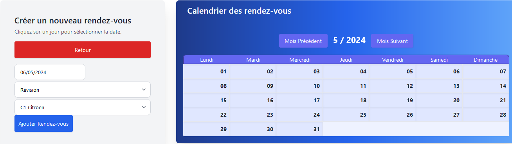

# TP Garage Automobile

## Description

Ce projet est une application web de gestion de garage automobile. Il permet aux utilisateurs de gérer les véhicules, les rendez-vous, les techniciens et les clients.

## Technologies Utilisées

- **Frontend**: Le frontend de l'application est construit avec Angular, un framework JavaScript pour la création d'applications web.

- **Backend**: Le backend de l'application est construit avec Java et Spring Boot. Le backend fournit des API REST pour le frontend. Hibernate est utilisé pour la persistance des données.

- **Base de Données**: La base de données utilisée est MariaDB contenue dans un conteneur Docker.

- ** Keycloak**: Keycloak est utilisé pour la gestion des utilisateurs et des rôles. En fonction du rôle de l'utilisateur, certaines fonctionnalités de l'application sont accessibles ou non.

## Descriptif des fonctionnalités
  
_Page d'accueil_

- ### Utilisateur Authentifié comme Administrateur
  
  - **Gestion des Clients**: L'administrateur peut modifier et supprimer des clients. 
    - Il peut également consulter la liste des clients.

  - **Gestion des Techniciens**: L'administrateur modifier et supprimer des techniciens. 
    - Il peut également consulter la liste des techniciens.

  - **Gestion des Véhicules**: L'administrateur modifier et supprimer des véhicules. 
    - Il peut également consulter la liste des véhicules.

    
  **Gestion des Rendez-vous**: L'administrateur modifier et supprimer des rendez-vous.
   
_Modification du technicien attitré au RDV_
 
    
_On obtient le résultat suivant_

   
  - Il peut également consulter la liste des rendez-vous.

  
- ### Utilisateur Authentifié comme Client
  - **Gestion des Clients**: Le client peut consulter ses informations personnelles.

  - **Gestion des Véhicules**: L'utilisateur peut consulter, à partir de son espace personnel, la liste de ses véhicules et ajouter un nouveau véhicule.

_Modification d'un véhicule_

    
_Ajout d'un véhicule personnel_

  - **Gestion des Rendez-vous**: L'utilisateur peut consulter la liste de ses rendez-vous et prendre un nouveau rendez-vous depuis un calendrier.

_Le calendrier permet de choisir une date et un créneau horaire pour le rendez-vous_

_Le rendez-vous à la date rend la case rouge pour indiquer qu'elle est prise_

_Le rendez-vous est ajouté à la liste des rendez-vous du client dans son espace personnel_

- ### Utilisateur authentifié comme Technicien

  - **Gestion des Rendez-vous**: Le technicien peut consulter la liste de ses rendez-vous et les modifier.

## Identifiants

### Keycloak 
- **Administrateur**: 
  - **Username**: admin
  - **Password**: admin
  
- **Client**: 
  - **Username**: client
  - **Password**: client
  
- **Technicien**: 
  - **Username**: technicien
  - **Password**: technicien
  
_Egalement un export de la configuration Keycloak est disponible dans le dossier Configuration projet/config_

## Base de Données
- **Username**: root
- **Password**: Password123!

_Egalement un export de la BDD est disponible dans le dossier Configuration projet/config_

